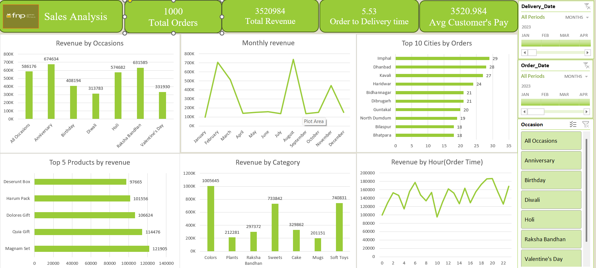

# Sales Analysis Dashboard

## Project Overview
This project analyzes 1,000 customer orders to identify key revenue drivers, seasonal trends, top-performing cities, and product categories.  
It provides actionable insights to help businesses understand customer behavior and optimize sales strategies.

---

## Project Statement & Insights
A detailed **Project Statement and Insights** document is included in this repository for a comprehensive understanding of the analysis, business objectives, and findings.  
Refer to [`Project Statments`](Problem_statement.pdf) and 
[`Project_Insights`](Ferns_and_Petals_Sales_analysis_Dashboard_insights.pdf) for a deeper dive.

---

## Key Insights
- **Total Revenue:** ₹3,520,984  
- **Average Customer Spend:** ₹3,520.98  
- **Order-to-Delivery Time:** 5.53 days  
- **Top Occasion:** Anniversary (₹674,000 revenue)  
- **Peak Months:** February and August  
- **Top Categories:** Colors, Soft Toys, and Sweets  
- **High-Order Cities:** Imphal, Dhanbad, Kavali  

---

## Tools Used
- Microsoft Excel – Data cleaning, transformation, and visualization  
- Power Query – Data preparation  
- Power Pivot – Data modelling  
- Pivot Tables and Charts – Trend and revenue analysis  

---

## Project Files
| File Name                | Description                                        |
|--------------------------|----------------------------------------------------|
| `Dashboard.png`          | Snapshot of the sales analysis dashboard          |
| `Ferns_and_petals.xlsx`  | Excel file with transformed data                     |
| `Project_Insights.pdf`   | Detailed report with project statement and insights|

---

## Download the Excel File
To download the cleaned dataset and dashboard file directly:  
[**Download Sales_Data.xlsx**](Ferns_and_petals.xlsx)

---

## How to Use
1. Download the repository.  
2. Open the `Sales_Data.xlsx` file in Excel.  
3. Review `Project_Insights.pdf` for detailed findings.  
4. Explore the dashboard and adjust filters to analyze different time periods or categories.

---

## Key Learning
- Developed an interactive dashboard to provide actionable business insights.  
- Applied Power Query, Power Pivot, Pivot Tables, and Charts for ETL and visualization.  
- Demonstrated the ability to deliver professional, data-driven insights from raw data.

---

## Contact
Name: Ayon Das  
Email: dasayan3089@gmail.com  
LinkedIn: [My LinkedIn Profile](https://www.linkedin.com/in/ayon-das-4b3212147/)  
GitHub: [My GitHub Profile](https://github.com/runTimeeRrorOccuRred)
